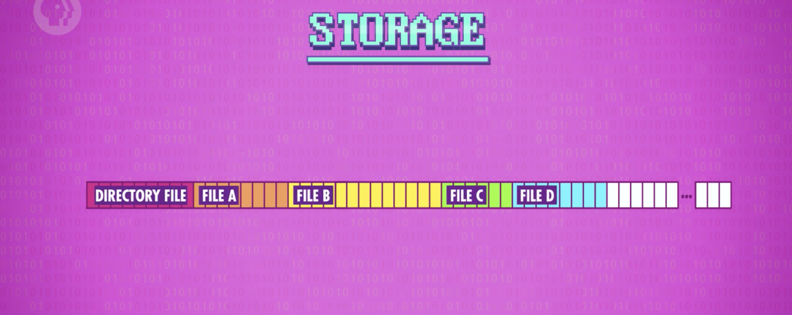
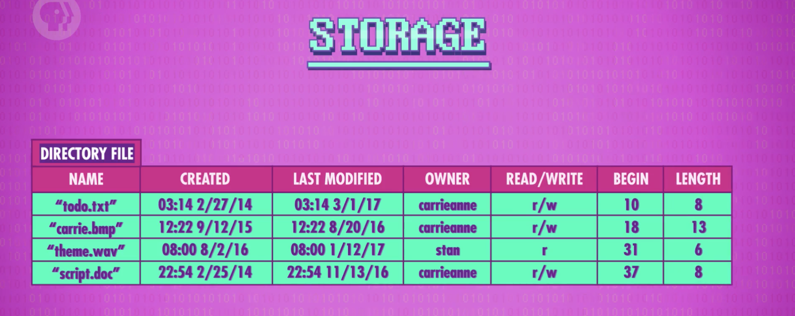
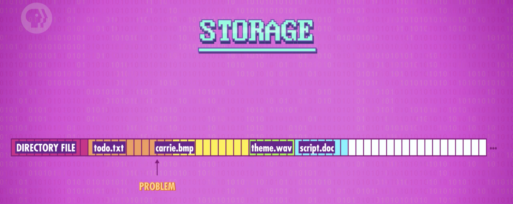
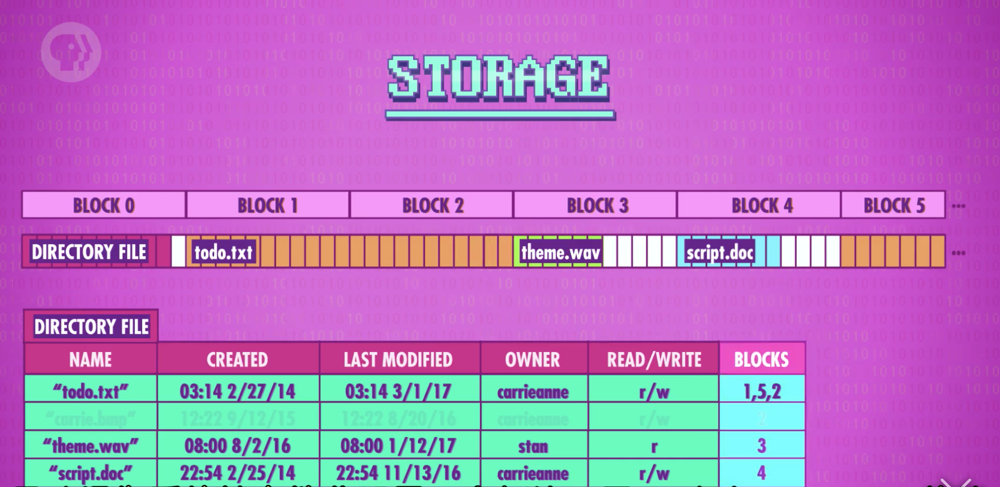
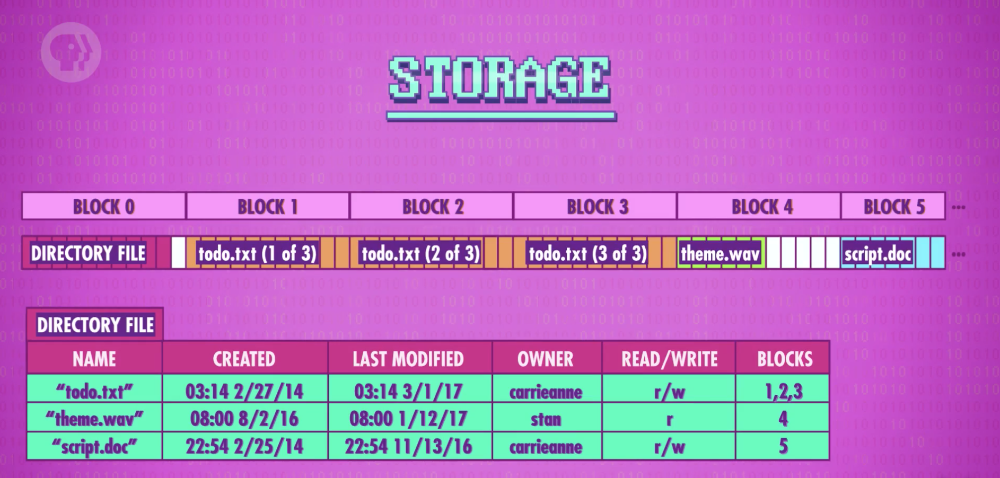
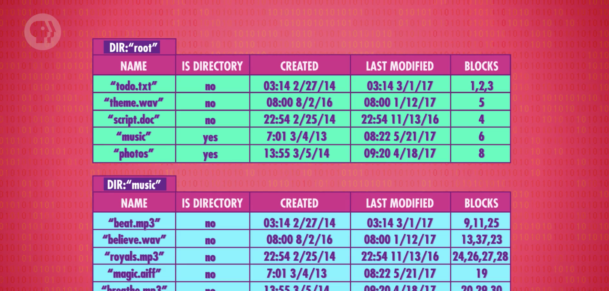

## 文件系统
随意排列文件的数据是完全可以的，但是如果以特定格式排列则会更有用，这被叫做“`文件格式`”，你可以发明自己的文件格式，程序员偶尔会这样做。但是最好的方式一般是用现成的标准，比如`JPEG`和`MP3`格式，让我们来看一看最简单的文件格式。最简单的文本文件，也被叫做`TXT文件`，里面包含的是用ASCII编码保存的二进制文件。
让我们看一个更复杂的例子：波形(Wave)文件，也叫做`WAV文件` ，它可以存储音频文件。但是在能正确的读取数据之前，我们需要知道一些信息，比如说码率(Bit rate)，以及是单声道(Single track)还是立体声(Stereo),这些关于数据的数据我们称为"`元数据`"(Meta data)，元数据存在文件的开头，在实际数据开始之前，也叫做“`文件头`”(Header) 

音频数据直接位于元数据后面，以一长串数据形式存储，这些值📄表示声音的幅度。播放这个文件时，音频程序需要启动计算机的扬声器，发射波形。现在您了解了文件格式的基础，让我们来谈一谈 "`位图`" (Bitmap), 或者说 BMP文件，它存粗的则是图片。在计算机上，图片由很多叫做“像素”的小方块构成，每个像素都是三种颜色的组合：红色，绿色和蓝色。它们合在一起被称为“加色三原色”(additive primary colors)， 混在一起可以创造其它颜色，就像WAV文件一样，BMP文件开头也是元数据，有图片宽度，图片高度，颜色深度(Color Depth)，举个例子，假设元数据说这个图片时4像素宽，4像素高，颜色深度是24位(bit),8 bits是红色，8 bits是绿色，8 bits是红色，提醒一下，8位(bit)和1个字节(byte)是一样的，而一个字节能存的数字最小是0，最大是255.

不管是文本文件，WAV文件，BMP文件，或者是其它一些我们没有讨论的文件格式，它们归根结底都是一样的：一长串二进制。文件格式是理解数据的关键。我们接下来讨论计算机是怎么存储这些文件。

早期电脑的整个存储器就像一整个大文件，数据从头到尾一直到占满。但是随着计算能力和存储容量的提高，同时存储多个文件变得非常有用。最简单的方法就是将文件`连续存储`(store files back-to-backs)，这样似乎是可以的，但是计算机是如何知道文件的开头和结尾呢，存储器没有文件的概念，它们知识能存储大量的bits，所以为了存储多个文件，我们需要一个特殊的文件，记录其它文件的位置。这个特殊的文件有很多名字，这里我们称为“`目录文件`”(Directory file)。 大多数的情况下它都在存储器的开头，所以我们知道去哪里寻找它。

在目录文件中，存着所有其它文件的名字，以及它们的`扩展名`(File extenstion)，这个扩展名帮助系统识别文件类型。除了最基本的文件名之外，目录文件还存储了有关这些文件的元数据，比如说创建时间，最后修改时间，文件的所有者是谁，以及师傅只可以读/写或者可以读写，但是其中最重要的还是文件的起始位置以及长度。

所以如果要添加文件，删除文件，更改文件名或之类的操作，我们必须要更新目录文件中的信息。就像书中的目录，如果你缩短或移动了一个章节，你就必须更新书本目录，不然页码就会对不上了。目标文件以及对其的管理是一个非常简单的`文件系统`的例子。文件系统负责管理文件，以上这个例子被称为“`平面文件系统`”，因为文件都存在同一个层次。当然，如上图所示，把文件紧密的放在一起有一个问题，如果我们我们想给“todo.txt”文件添加一点数据，就会覆盖掉后面“carrie.bmp”文件的一部分，会破坏后文件的关键的元数据。

所以现代的文件系统会做两件事情，首先他们会把文件储存在`块`(Block)中,留下了一点额外空间便于改动，叫“`预留空间`”(Slack space)，也意味着所有的文件数据都是统一的块级大小，方便管理，在这样的方案中，目录文件就不会保存文件的开始位置了，它们会保存文件所在的块中，现代文件系统所做的第二件事情，就是允许文件被拆分成多份，存在不同块里。假设打开“todo.txt”添加了一些内容，然后文件太大不能存在一个块里，同时我们也不想覆盖掉隔壁的块，所以文件系统会分配一个没被使用的块，供容纳额外的数据。使用这样的方案，目录文件不止记录文件在哪一个“块”，而是在哪一些块中，这样只需要分配块，文件就可以轻松的增大或者缩小。现在假设我们不需要“carrie.bmp”文件了，想删除“carrie.bmp”文件，只需要在目录文件中删掉那条记录，导致文件用的块变成可用。**`注意，在这里我们并没有真正的擦除掉数据，我们只是删除了记录，之后的某个时刻，该块会被新的数据覆盖，但是在此之前，数据还在原处`**。现在假设我们给“todo.txt”文件中添加了更多的信息，导致操作系统给文件分配另一个新块，用了刚刚“carrie.bmp”所在的块。

现在“todo.txt”存在了三个块中，并且没有顺序。这种情况叫做`碎片`(Fragmentation)，碎片是新增/删除/修改文件导致的不可避免的副产品，对于大多数存储技术来说碎片并不是好事，如果在磁带上，将"todo.txt"读入内存，需要先读取块1，然后是5，再然后是3，这样来回转。在现实世界的文件系统中，大文件可能会存在数百个块里，你不想等五分钟才打开文件，那么怎样解决这个问题呢，答案是`碎片管理`(Defragmentation),听起来好像十分复杂，实际上的原理其实很简单。计算机把数据放到顺序正确的相连块中，整理之后，"todo.txt"在块1，2，3中，方便快捷。

到目前为止我们讨论的都是平面文件系统，它们都存在同一个目录里，如果你只有一点存储空间，这种方案或许就够用了。但是随着存储容量的爆炸式增长，文件数量也在飞速增长，将所有的文件存在同一个层次，变得不切实际。就像现实生活中的文件一样，将相关的计算机文件放在一起会方便很多，我们还可以把相关的文件夹放在同一个文件夹中。这被称为“`分层文件系统`”(Hierarchical File System)，和“平面文件系统“最大的区别就是目录文件不仅需要只想其它文件，还有其它目录。为了区分目录和文件，我们需要额外的元数据。假设我们的目录文件在最顶层，这个目录也叫做`根目录`(Root Directory)，所有其他文件文件夹都在这个目录下。

可以看到根目录文件有3个文件以及2个子文件夹：“音乐”和“照片”，如果想看“音乐”目录里面有什么，我们必须去那个区块，读那里的目录文件，格式与根目录文件完全相同。这个方法还可以让我们很轻松的移动文件。如果我们想把“theme.wav”从根目录移动到音乐目录，我们不用挪动任何数据块，只需要简单的修改两个目录文件，从一个中删除一条记录，并添加到另一个目录当中。“theme.wav”文件依然在块5中.

