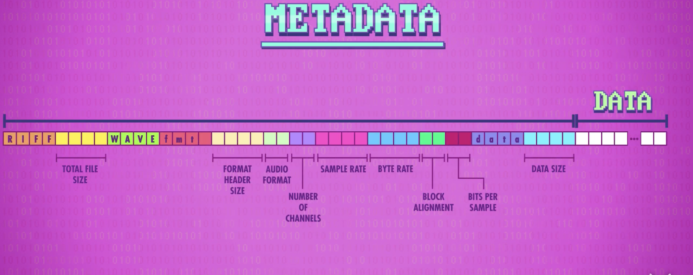
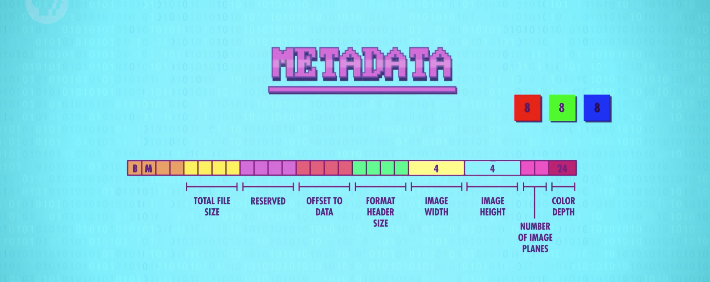
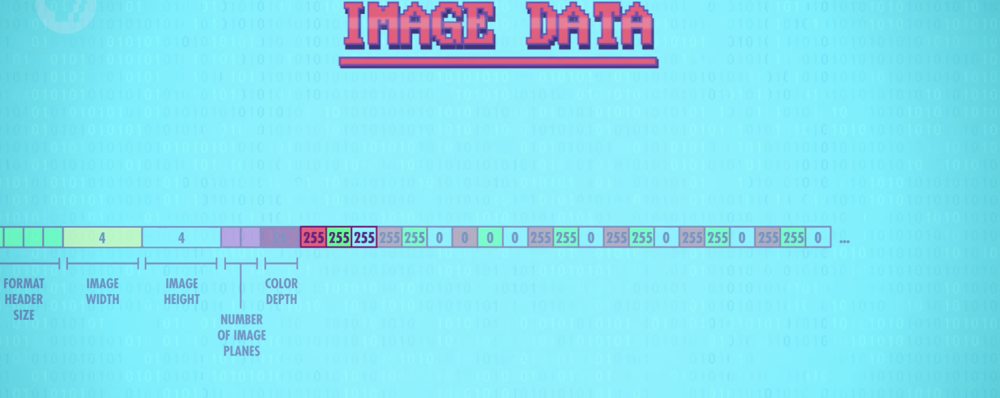

## 文件系统
随意排列文件的数据是完全可以的，但是如果以特定格式排列则会更有用，这被叫做“`文件格式`”，你可以发明自己的文件格式，程序员偶尔会这样做。但是最好的方式一般是用现成的标准，比如`JPEG`和`MP3`格式，让我们来看一看最简单的文件格式。最简单的文本文件，也被叫做`TXT文件`，里面包含的是用ASCII编码保存的二进制文件。
让我们看一个更复杂的例子：波形(Wave)文件，也叫做`WAV文件` ，它可以存储音频文件。但是在能正确的读取数据之前，我们需要知道一些信息，比如说码率(Bit rate)，以及是单声道(Single track)还是立体声(Stereo),这些关于数据的数据我们称为"`元数据`"(Meta data)，元数据存在文件的开头，在实际数据开始之前，也叫做“`文件头`”(Header) 

音频数据直接位于元数据后面，以一长串数据形式存储，这些值📄表示声音的幅度。播放这个文件时，音频程序需要启动计算机的扬声器，发射波形。现在您了解了文件格式的基础，让我们来谈一谈 "`位图`" (Bitmap), 或者说 BMP文件，它存粗的则是图片。在计算机上，图片由很多叫做“像素”的小方块构成，每个像素都是三种颜色的组合：红色，绿色和蓝色。它们合在一起被称为“加色三原色”(additive primary colors)， 混在一起可以创造其它颜色，就像WAV文件一样，BMP文件开头也是元数据，有图片宽度，图片高度，颜色深度(Color Depth)，举个例子，假设元数据说这个图片时4像素宽，4像素高，颜色深度是24位(bit),8 bits是红色，8 bits是绿色，8 bits是红色，提醒一下，8位(bit)和1个字节(byte)是一样的，而一个字节能存的数字最小是0，最大是255.
<!--
-->
<!--    -->
<!--    -->
<!--
-->

